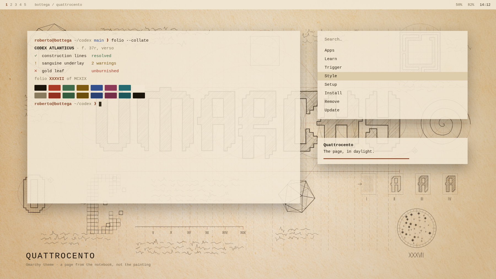

# Quattrocento

A page from the notebook, not the painting.

Linux has mostly been a means to an end for me. Omarchy is the first version
of it that felt like a *place* — opinionated, finished, and so plainly built by
someone who cared that it makes you want to go and build something yourself.

That is the part I did not expect. Sitting down at this desktop puts me in a
state I recognise from very few other things: the pull to make, to take apart,
to lose an evening finding out how something works. Somewhere in the middle of
that I started thinking about Leonardo — not the paintings, the notebooks. The
pages where a man who could not stop being curious put a flying machine, a
study of moving water and a note about what he owed the grocer on the same
sheet, in whatever order they turned up.

The Renaissance was that same restlessness at the scale of a century: the
moment when making things and understanding things stopped being separate
jobs. Omarchy is a small modern echo of it, and this theme is me saying so out
loud.

That century did not inherit its alphabet, it *constructed* it. Pacioli
built the Roman capitals with compass and straightedge in *De Divina
Proportione* — the book Leonardo illustrated — and Dürer did it again in
*Underweysung der Messung*. Letters as a geometry problem, with the working
lines left visible on the page.

Omarchy's wordmark is the same kind of object: no curves anywhere, every glyph
assembled from squares on a fifteen-unit grid. It belongs on that page. So
this theme starts from a wallpaper that puts it there — the mark half-hatched,
the construction lines running through it and off the edge of the sheet, the
solids and the spiral and the trials crowding the margins — and then takes its
palette from the two things actually on that page: iron gall ink, and red
chalk.



*Mock-up, not a screenshot — see [PREVIEW.md](PREVIEW.md).*

Tonal rather than contrasting. Where Dawn sets a cold signal against a warm
ground, this one keeps everything inside a single hue family and lets the
accent sit one step from the surface instead of across from it. The discipline
that holds it together is a rule: every named colour is a pigment a workshop
could grind in 1500. No colour is here because a terminal palette expects it.

## Install

```bash
omarchy theme install https://github.com/r-bart/omarchy-quattrocento-theme.git
omarchy theme set quattrocento
```

Or use *Install > Style > Theme* in the Omarchy menu, then pick
**Quattrocento** under *Style > Theme* (`Super + Ctrl + Shift + Space`).

Requires Omarchy 4. The palette uses the semantic key set, which does not exist
in 2.x.

## Palette

| Key | Value | |
|-----|-------|---|
| `accent` | `#8a4a2c` | sanguine |
| `background` | `#f0e6d3` | parchment |
| `lighter_background` | `#e9dfc9` | |
| `foreground` | `#33291b` | iron gall |
| `bright_foreground` | `#1c150c` | bone black |
| `selection` | `#ddcdab` | |
| `muted` | `#8a7a5e` | silverpoint |

The chromatics, and what each one is:

| Key | Value | Pigment |
|-----|-------|---------|
| `red` | `#a83a26` | vermilion |
| `orange` | `#95521a` | burnt ochre |
| `yellow` | `#7d5a10` | orpiment |
| `green` | `#3f6b4a` | verdigris |
| `cyan` | `#256a70` | blue verditer |
| `blue` | `#34508c` | ultramarine, ground lapis |
| `magenta` | `#8c3a58` | madder lake |
| `brown` | `#6b4a2c` | raw umber |

Window borders come from `hyprland_active_border`, a gradient from sanguine
into iron gall — the two media of the drawing.

### Contrast

WCAG relative luminance, against both surfaces a theme renders text on.
`lighter_background` is where tooltips, floats, status lines and Neovim's
`NormalFloat` sit — the surface most palettes forget to check.

| | on `background` | on `lighter_background` |
|---|---|---|
| `foreground` | 11.51 | 10.76 |
| `bright_foreground` | 14.60 | 13.65 |
| `accent` | 5.48 | 5.12 |
| `red` | 5.14 | 4.81 |
| `green` | 4.97 | 4.65 |
| `cyan` | 5.03 | 4.70 |
| `blue` | 6.35 | 5.94 |
| `magenta` | 5.93 | 5.54 |
| `muted` | 3.38 | 3.16 |

Every chromatic clears 4.5:1 on both. Body text clears 10:1.

True sanguine is `#9a5a3a`, and it does not clear the floor — 4.47 and 4.12.
The accent is that pigment darkened until it does. It is the one place where
the rule bends to the contrast requirement rather than the other way round.

## What it ships

`colors.toml`, `icons.theme` and `backgrounds/`. Nothing in this repository
runs on your machine: no `neovim.lua`, no terminal config, no `vscode.json`.

That is a choice, not a constraint. Leaving them out is what makes the entire
desktop fall out of the palette, window borders included — and it is also why
`shell.toml` is left to Omarchy's template, so this theme keeps picking up
shell improvements on each release instead of pinning a snapshot.

`hyprland-extra.lua` is documentation, not a theme file. Omarchy never reads
it — see [Window metrics](#window-metrics).

## Backgrounds

Four, cycled with `Super + Ctrl + Space`. The same four ship with
[Quattrocento Dusk](https://github.com/r-bart/omarchy-quattrocento-dusk-theme);
only the order differs, so each theme opens on the pair that matches it.

| File | Scene |
|------|-------|
| `1-codex.jpg` **(default)** | The full page in daylight, graded: a soft vignette pulls the eye to the wordmark and warms the centre. Windows land on quiet parchment on every side. |
| `2-folio.jpg` | The same page flat, no vignette, no warming. Cooler and more even — better if you run high window opacity or a bright room. |
| `3-vigil.jpg` | The night page: brass on dark vellum, one candle at the upper left. |
| `4-taper.jpg` | The night page on a warmer, redder skin. |

All four are 2912×1632, JPEG at quality 95 with no chroma subsampling. Full chroma
matters: the sanguine construction lines are a thin warm stroke on a warm
ground, and 4:2:0 turns them to mud. Built with
`cjpeg -quality 95 -sample 1x1 -optimize`.

JPEG, not WebP. A stock Omarchy 4 install has no Qt WebP decoder, and a WebP
wallpaper fails at decode time, leaving a black desktop and blank thumbnails.

The page itself is generated, not drawn: the wordmark is the real `logo.svg`
geometry with a hand-stroke treatment applied, and every study on the sheet is
computed — the polyhedra from their actual vertex coordinates, the module
explosion from the glyph's own fifteen-unit grid.

Add your own in `~/.config/omarchy/backgrounds/quattrocento/` — they appear
alongside these.

## Window metrics

Not part of the theme. Omarchy never reads a Hyprland config from a theme
directory; the only thing a theme sends the compositor is
`hyprland_active_border`. To match the design, paste `hyprland-extra.lua` into
`~/.config/hypr/looknfeel.lua`.

## The rest of the set

The same four wallpapers, opposite palette over them.

| Theme | |
|-------|--|
| [Quattrocento Dusk](https://github.com/r-bart/omarchy-quattrocento-dusk-theme) | Walnut ground, worn brass accent. The same page by candlelight. |

## License

MIT. See [LICENSE](LICENSE).
